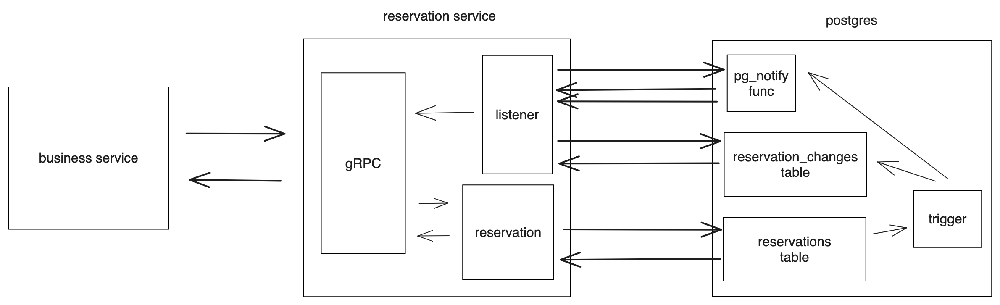

# Core Reservation

- Feature Name: core_reservation_feature
- Start Date: 2024-03-26

## Summary

A core reservation service that solves the problem of reserving a resource for a specific period of time. We leverage postgres EXCLUDE constraints to ensure that only one reservation can be made for a give resource at a given time.

## Motivation

We need a common solution for various reservation use cases. For example, we need to reserve a room for a meeting, reserve a seat on a flight, or reserve a table at a restaurant. We need a common solution that can be used across all these use cases.

## Guide-level explanation

Flowchart:


Reservation service provides the following APIs:

1. reserve: reserve a resource for a specific period of time.
2. confirm: change the status of a reservation.
3. update: update the note of a reservation.
4. cancel: cancel a reservation.
5. get: get a reservation by id.
6. query: query reservations by user_id, resource_id, status, start, and end.

Listener:

1. reservation service listen to "reservation_notify" channel for reservation changes.
2. once got a notification, check the reservation_changes table and pick up changes.
3. if any other system wants to watch for reservation changes, send the changes by using streaming response.

### Service interface

We would use gRPC to define the service interface. Below is the proto definition:

```proto
enum ReservationStatus {
    RESERVATION_STATUS_UNKNOWN = 0;
    RESERVATION_STATUS_PENDING = 1;
    RESERVATION_STATUS_CONFIRMED = 2;
    RESERVATION_STATUS_BLOCKED = 3;
}

enum ReservationChangeType {
    RESERVATION_CHANGE_TYPE_UNKNOWN = 0;
    RESERVATION_CHANGE_TYPE_CREATE = 1;
    RESERVATION_CHANGE_TYPE_UPDATE = 2;
    RESERVATION_CHANGE_TYPE_DELETE = 3;
}

message Reservation {
    string id = 1;
    string user_id = 2;
    ReservationStatus status = 3;

    // resource reservation
    string resource_id = 4;
    google.protobuf.Timestamp start = 5;
    google.protobuf.Timestamp end = 6;

    // extra note
    string note = 7;
}

message ReserveRequest {
    Reservation reservation = 1;
}

message ReserveResponse {
    Reservation reservation = 1;
}

message ConfirmRequest {
    string id = 1;
}

message ConfirmResponse {
    Reservation reservation = 1;
}

message UpdateRequest {
    string note = 1;
}

message UpdateResponse {
    Reservation reservation = 1;
}

message CancelRequest {
    string id = 1;
}

message CancelResponse {
    Reservation reservation = 1;
}

message GetRequest {
    string id = 1;
}

message GetResponse {
    Reservation reservation = 1;
}

message QueryRequest {
    string resource_id = 1;
    string user_id = 2;

    // use status to filter reservations. if UNKNOWN, return all reservations
    ReservationStatus status = 3;
    google.protobuf.Timestamp start = 4;
    google.protobuf.Timestamp end = 5;
}

message WatchRequest {}

message WatchResponse {
    ReservationChangeType change_type = 1;
}

service ReservationService {
    rpc reserve(ReserveRequest) returns (ReserveResponse);
    rpc confirm(ConfirmRequest) returns (ConfirmResponse);
    rpc update(UpdateRequest) returns (UpdateResponse);
    rpc cancel(CancelRequest) returns (CancelResponse);
    rpc get(GetRequest) returns (GetResponse);
    rpc query(QueryRequest) returns (stream Reservation);
    // another system could watch for reservation changes like: added/confirmed/canceled
    rpc watch(WatchRequest) returns (stream WatchResponse);
}
```

### Database schema

We use postgres as the database. Below is the schema definition:

```sql
CREATE SCHEMA rsvp;

CREATE TYPE rsvp.reservation_status AS ENUM ('UNKNOWN','PENDING', 'CONFIRMED', 'BLOCKED');

CREATE TYPE rsvp.reservation_change_type AS ENUM ('UNKNOWN', 'CREATE', 'UPDATE', 'DELETE');

CREATE TABLE reservations (
    id uuid NOT NULL DEFAULT uuid_generate_v4(),
    user_id varchar(64) NOT NULL,
    resource_id varchar(64) NOT NULL,
    timespan tstzrange NOT NULL,
    status rsvp.reservation_status NOT NULL DEFAULT 'PENDING',
    note text

    CONSTRAINT pk_reservations PRIMARY KEY (id),
    CONSTRAINT reservations_conflict EXCLUDE USING gist (resource_id WITH =, timespan WITH &&)
);

CREATE INDEX idx_reservations_user_id ON rsvp.reservations (user_id);

CREATE INDEX idx_reservations_resource_id ON rsvp.reservations (resource_id);

-- if uid is null, find all reservations within during for the resource
-- if rid is null, find all reservations within during for the user
-- if during is null, find all reservations for the user and resource
-- if both uid and rid are null, find all reservations within during
-- if all set, find all reservations within during for the user and resource
CREATE OR REPLACE FUNCTION rsvp.query(uid varchar(64), rid varchar(64), during tstzrange) RETURNS TABLE rsvp.reservations AS $$
BEGIN
    RETURN QUERY
    SELECT *
    FROM rsvp.reservations
    WHERE (uid IS NULL OR user_id = uid)
      AND (rid IS NULL OR resource_id = rid)
      AND (during IS NULL OR timespan && during);
END;
$$ LANGUAGE plpgsql;

-- reservation change queue
CREATE TABLE reservation_changes (
    id serial NOT NULL,
    reservation_id uuid NOT NULL,
    change_type rsvp.reservation_change_type NOT NULL,
    change_time timestamptz NOT NULL DEFAULT now()
);

-- trigger for add/update/delete a reservation
CREATE OR REPLACE FUNCTION rsvp.watch_reservation() RETURNS TRIGGER AS $$
BEGIN
    IF TG_OP = 'INSERT' THEN
        INSERT INTO rsvp.reservation_changes (reservation_id, change_type) VALUES (NEW.id, 'CREATE');
    ELSIF TG_OP = 'UPDATE' THEN
        IF OLD.status <> NEW.status THEN
            INSERT INTO rsvp.reservation_changes (reservation_id, change_type) VALUES (NEW.id, 'UPDATE');
        END IF;
    ELSIF TG_OP = 'DELETE' THEN
        INSERT INTO rsvp.reservation_changes (reservation_id, change_type) VALUES (OLD.id, 'DELETE');
    END IF;
    -- notify a channel for reservation changes called reservation_notify
    pg_notify('reservation_notify', '');
    RETURN NULL;
END;
$$ LANGUAGE plpgsql;

CREATE TRIGGER watch_reservation AFTER INSERT OR UPDATE OR DELETE ON rsvp.reservations FOR EACH ROW EXECUTE FUNCTION rsvp.watch_reservation();
```

Here we use `EXCLUDE` constraint provided by postgres to ensure that on overlapping reservations cannot be made for a given resource at a given time.

```sql
CONSTRAINT reservations_conflict EXCLUDE USING gist (resource_id WITH =, timespan WITH &&)
```

We also use a trigger to notify a channel for reservation changes. This can be used by another system to watch for reservation changes. To make sure even we missed certain messages we can use a queue to record changes. Thus when we receive a notification we can query the queue to get the changes since last time we checked, and once we finished processing all the changes we can delete them from the queue.

Notes:

1. implement sqlx::Type for protobuf enum types.
2. implement FromRow for Reservation data structure.

### Other

Implement a CLI tool to assist with testing.

1. `rsvp server start/stop`: start/stop the reservation service.
2. `rsvp create -r <resource_id> -u <user_id> -w (start, interval)`: create a reservation.
3. `rsvp confirm -i <reservation_id>`: confirm a reservation.
4. `rsvp update -i <reservation_id> -n <note>`: update the note for a reservation.
5. `rsvp cancel -i <reservation_id>`: cancel a reservation.
6. `rsvp get -i <reservation_id>`: get a reservation by id.
7. `rsvp query -r <resource_id> -u <user_id>` -w (start, end): query reservations.

## Reference-level explanation

TBD

## Drawbacks

N/A

## Rationale and alternatives

N/A

## Prior art

N/A

## Unresolved questions

- How to handle repeated reservation? - is this more ore less a business logic which shouldn't be put into this layer? (non-goal: we consider this is a business logic and should be handled by the caller)
- If load is big, we may use an external queue for recording changes.
- We haven't considered tracking/observability/deployment yet.
- Query performance might be an issue - need to revisit the index and also consider using cache.

## Future possibilities

TBD
